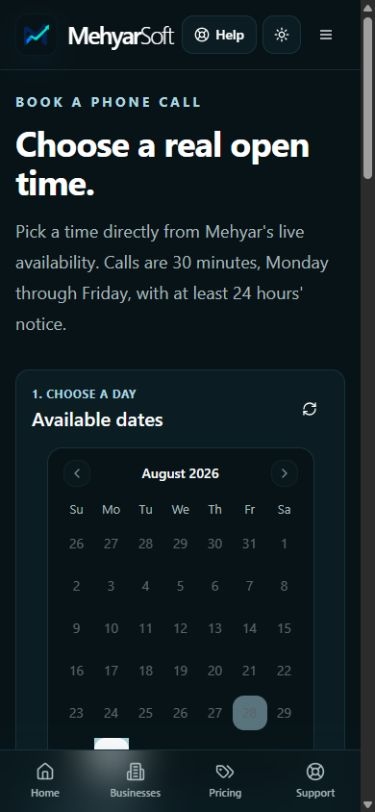
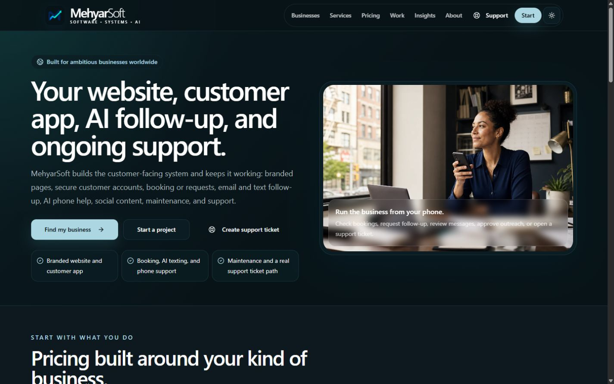
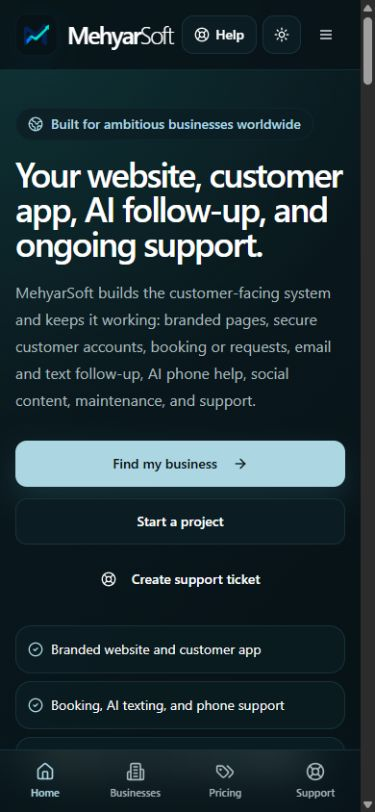
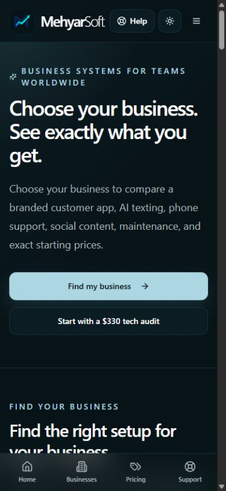
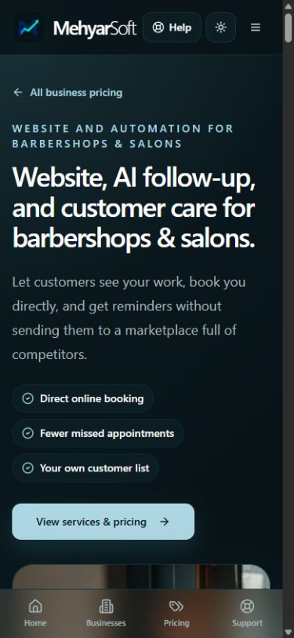
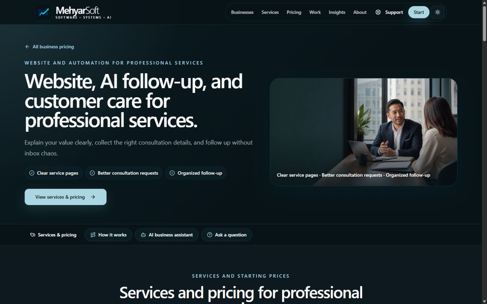
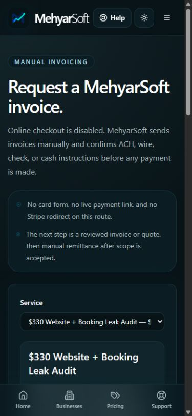
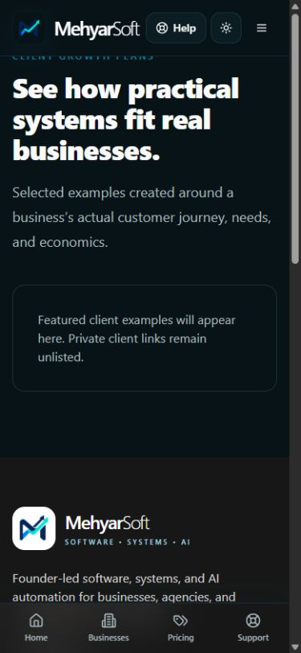
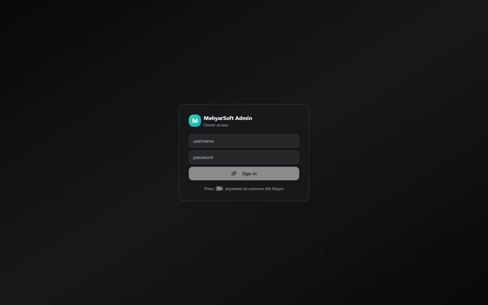

# Mehyar.us first-time buyer and owner-dashboard audit

Date: August 28, 2026  
Production surface: `https://mehyar.us` and `https://dashboard.mehyar.us`  
Perspective: first-time business owner, local-service buyer, professional-services buyer, enterprise buyer, and agency owner

## Change completed before the audit

Customer-facing Zoho branding was removed from the booking journey. The public copy now says “live availability,” “confirming your appointment,” and “your appointment is confirmed.” Public calendar failures are translated into vendor-neutral messages so upstream provider errors cannot reveal the integration name.

The production booking page loaded real availability after deployment. A fresh rendered crawl of 44 public routes found no visible Zoho wording.

## Executive verdict

The site works, but it still asks visitors to understand MehyarSoft before it earns their trust. A new buyer sees a large catalog of websites, booking, AI follow-up, voice, social media, support, OpenClaw, Hermes, audits, custom software, apps, proposals, and industry packages. The company can do more than most small agencies, yet the volume and repetition make the offer feel less certain instead of more capable.

The strongest commercial redesign is not “add more content.” It is to create a clear buying ladder:

1. **Choose a path:** Grow my business or Build a complex system.
2. **See proof:** real screenshots, named outcomes, client evidence, delivery process, and risk controls.
3. **Choose one next step:** book a call, buy the diagnostic, or request an enterprise scope.
4. **Move through one operating system:** lead, discovery, proposal, agreement, deposit, delivery, support, renewal.

The public site needs fewer repeated explanations and more proof. The dashboard needs fewer overlapping workspaces and a complete client lifecycle.

## Buyer scorecard

| Area | Score | Buyer reaction |
|---|---:|---|
| Technical stability | 8/10 | Pages render reliably and images load. |
| Immediate comprehension | 5/10 | I understand individual features, but not the full company or best starting point. |
| Local-business relevance | 7/10 | Barber and restaurant language is familiar, but the pages become extremely long. |
| Professional-services credibility | 4/10 | “Professional services” is too broad to persuade a lawyer, accountant, or consultant. |
| Enterprise credibility | 3/10 | Enterprise software, cloud, data, and DevOps capabilities remain largely invisible. |
| Trust and proof | 3/10 | Claims are not supported by enough case studies, testimonials, logos, or measured results. |
| Pricing confidence | 5/10 | Starting prices exist, but inclusions, limits, usage costs, ownership, and buying steps vary. |
| Purchase momentum | 4/10 | The path ends in manual invoicing and multiple competing forms. |
| Mobile navigation | 4/10 | Businesses and Pricing duplicate one another while higher-value destinations are absent. |
| Admin operating coverage | 7/10 | Many powerful tools exist, but client delivery, payments, support, and lifecycle continuity are incomplete. |

## Fresh visual evidence

### First desktop impression

The page is visually polished, but the first promise is limited to customer-facing systems. Three calls to action compete before evidence appears, and support is promoted like a sales product.

### First mobile impression

The first mobile screen is almost entirely copy and actions. The product image and proof are below the fold. Help, Create support ticket, and Support all appear before the visitor knows why MehyarSoft is credible.

### Business and pricing entry

The fixed Businesses and Pricing tabs take visitors to effectively the same place. The page asks the buyer to choose from a directory before explaining the larger capability or showing proof.

### Strongest industry opening

The barber opening is relevant and easy to understand. Its later sections weaken it by adding frameworks, ten workflows, several additional packages, and infrastructure choices.

### Professional-services buyer

The page looks professional but could describe a lawyer, accountant, agency, consultant, or financial adviser. A high-trust buyer needs a page that demonstrates their actual intake, privacy, review, and workflow requirements.

### Current purchase endpoint

The purchase page leads with what customers cannot do: no online checkout, no live payment link, and manual remittance. This interrupts momentum after the customer has finally selected an offer.

### Public proof endpoint

The footer invites visitors to view client growth plans, but the directory contains no public examples. This damages trust more than hiding the route would.

### Dashboard entry

The login screen is clean but provides no recovery, second factor, session explanation, or security status for a dashboard containing leads, email, financial data, proposals, and operational controls.

## Forty buyer-perspective findings

### Positioning and first impression

1. **Critical — The homepage still presents only the customer-facing half of MehyarSoft.** CRM platforms, internal applications, APIs, databases, AWS, Azure, Google Cloud, Cloudflare architecture, DevOps, data engineering, and regulated-system delivery are missing from the first screen and primary navigation.
2. **Critical — There is no clear split between local-business growth systems and enterprise engineering.** Trying to sell both through one generic “Services” page makes each audience less confident.
3. **High — The hero explains features before establishing credibility.** A new client needs to know who this is for, what outcome changes, and why MehyarSoft is believable.
4. **High — Three hero calls to action create hesitation.** “Find my business,” “Start a project,” and “Create support ticket” ask a new visitor to make different decisions at once.
5. **High — Support is over-promoted to prospects.** Support is valuable after purchase; it should not receive equal prominence with starting a project.
6. **Medium — The repeated “leak” metaphor makes the brand sound negative.** It works for one diagnostic offer but becomes tiring across contact, newsletter, blog, service, and portfolio copy.
7. **Medium — The company name and visual quality suggest engineering depth that the copy does not reveal.** The design says software company; the page hierarchy says booking-and-follow-up agency.

### Navigation and mobile design

8. **Critical — Businesses and Pricing duplicate the same mobile destination.** One of four permanent tabs is effectively wasted.
9. **Critical — Solutions, Enterprise, Work, Booking, and Contact are absent from the mobile bottom bar.** The most valuable buyer journeys require opening the hamburger menu.
10. **High — Help, support-ticket creation, and Support appear too early and too often on mobile.** They crowd out proof, industries, and consultation.
11. **High — The fixed bottom navigation covers useful vertical space throughout extremely long pages.** It is most costly on industry pages and forms.
12. **High — The first mobile viewport does not show product proof.** The homepage image and industry imagery start below the copy and multiple buttons.
13. **Medium — The dark visual system is coherent but visually flat over long pages.** Alternating light sections, stronger data visuals, screenshots, and outcome bands would create rhythm without changing the brand.
14. **Medium — Too many sections use the same rounded card treatment.** Service tiers, benefits, use cases, FAQs, support plans, and agent plans become visually indistinguishable.

### Industry pages and pricing

15. **Critical — Ten industry pages are structurally almost identical.** Their headings, section counts, package mechanics, agent material, and calls to action feel generated from one template rather than designed around ten buying processes.
16. **Critical — “73 business types” overstates specialization.** Those labels map into ten underlying pages. A lawyer, chiropractor, photographer, or daycare owner may feel misled when the destination is generic.
17. **High — The lawyer path is not a law-firm path.** It lacks conflict-check routing, consultation qualification, matter-type intake, confidentiality boundaries, document workflows, and legal-industry evidence.
18. **High — Clinics need a stronger trust and compliance story.** The site should show minimum-data intake, staff handoff, consent, audit trails, access boundaries, and what is deliberately not automated.
19. **High — Restaurant value should center on menu accuracy, reservations, catering/private events, reviews, and repeat visits.** Generic AI-agent material comes too early.
20. **High — Barber pricing is understandable until the page introduces a second package system.** Three service levels should remain the only primary comparison.
21. **High — OpenClaw and Hermes are implementation details, not buyer categories.** Sell a “24/7 AI Command Center,” then explain platform choices in a technical disclosure.
22. **High — AI phone service and social-video production should not be forced into the same top tier.** They solve different problems and should be selectable modules.
23. **High — Usage-based costs are not consistently explained.** SMS, calling, AI inference, generated media, storage, and third-party services need a simple allowance-and-overage table.
24. **High — Fixed-price, monthly, annual, and bring-your-own-infrastructure options are not explained through one consistent model.** Buyers cannot easily compare total first-year cost.
25. **Medium — Maintenance promises are broad.** Define response time, included hours, update limits, incident handling, backups, content changes, and what requires a new quote.
26. **Medium — The section navigation rail looks like a browser scrollbar on mobile.** Off-screen pills do not clearly communicate that they are swipeable.

### Trust, proof, and persuasion

27. **Critical — There are no strong real case studies.** “Engagement patterns” describe hypothetical delivery approaches rather than named situations with before/after evidence.
28. **Critical — There are no visible testimonials, logos, or independent proof.** The automated scan found no testimonial language across the public routes.
29. **Critical — The public proposal directory is empty.** Remove its promotion until at least three polished examples exist.
30. **High — Generic stock-style photography does not prove technical delivery.** Show the actual booking system, admin dashboard, AI proposal studio, automation timeline, mobile PWA, and operating reports.
31. **High — The site does not provide a risk-reversal mechanism.** The $330 audit could be credited toward a larger project, with a written deliverable and explicit “no build commitment” promise.
32. **Medium — Blog content reinforces only the small-business narrative.** Add enterprise architecture, AI governance, cloud modernization, integration reliability, data systems, and regulated-delivery articles.

### Conversion and purchase

33. **Critical — The final purchase experience is manual and framed negatively.** It says online checkout is disabled before emphasizing the safety or simplicity of the process.
34. **High — There is no immediate deposit or reservation path.** A ready buyer cannot pay a diagnostic, reserve a sprint, or accept a scoped proposal online.
35. **High — Free discovery and the $330 audit compete without a decision rule.** Clearly state: free call for fit; paid audit for diagnosis and a written plan.
36. **High — Contact, support, audit, booking, newsletter, invoice, and package forms do not feel like one relationship.** They should all create or update one contact record and preserve context.
37. **Medium — “Cloudflare verification” is implementation language.** Customers only need “Secure verification appears when your details are ready.”
38. **Medium — Booking shows Eastern Time without local conversion.** A global buyer should see their local timezone and the business timezone together.
39. **Medium — Booking lacks obvious reschedule and cancellation paths.** Confirmation email replies are a fallback, not a complete appointment-management experience.
40. **Medium — Two rendered pages still receive the runtime title “Page Not Found.”** `/apps` and `/data-deletion` display correct content but get incorrect client-side titles.

## What the admin dashboard already has

The current codebase is more capable than the public site suggests. The active owner dashboard includes:

- **Clients:** appointments, live calendar records, leads, every form submission, AI proposals, sent replies, complete metadata, event history, and direct email responses.
- **Mayor:** automation status, outreach activity, replies, daily actions, pipeline value, opportunity scoring, deliverability, scheduling, and operational checks.
- **CRM:** mixed lead inbox, local-business prospects, government opportunities, inbound replies, lifecycle filters, sorting, bulk actions, business scanning, AI evaluation, EU scouting, and job discovery.
- **Sent:** outbound message history, reply and interest rates, recipient and content inspection.
- **Money:** pipeline value, weighted forecast, win rate, average deal size, invoice and quote tracking, open deals, outcomes, service catalog, quote generation, and case-study creation.
- **System:** event audit, scheduled jobs, manual cron runs, backups, database/LLM health, and AI provider settings.
- **AI command bar:** natural-language questions and administrative actions are available across several workspaces.

These features are substantial, but the dashboard behaves like several powerful tools placed next to each other rather than one client lifecycle.

## Admin shortcomings

1. **Clients and CRM overlap.** Both contain leads and replies, so the owner must remember which workspace owns which action.
2. **Mayor and the hidden “Now” page overlap.** The system needs one daily command center, not two concepts for “what should I do now?”
3. **Six mobile tabs are crowded.** The navigation should prioritize Today, Relationships, Sales, Delivery, and More.
4. **The business lifecycle stops after “won.”** There is no first-class contract, deposit, onboarding, project, acceptance, support, renewal, or offboarding flow.
5. **There is no unified client record.** Forms, calls, email, proposal, deal, invoice, project, ticket, and renewal should appear in one chronological account view.
6. **There is no universal task and follow-up engine.** Every lead, project, invoice, and ticket needs an owner, next action, due time, reminder, and overdue status.
7. **Appointment operations are incomplete.** Add reschedule, cancel, no-show, reminder delivery, attendance outcome, and follow-up task creation.
8. **Proposal analytics are missing.** Track opened, sections viewed, time spent, pricing interaction, forwarded visits, accepted, declined, and questions.
9. **Proposal acceptance is disconnected.** Add approval, e-signature, deposit, and automatic project creation.
10. **Payments are manual.** Add online deposits, invoice status, payment reminders, recurring retainers, refunds/credits, and reconciliation.
11. **Delivery management is absent.** Add milestones, deliverables, access requests, decisions, files, approvals, blockers, time spent, and change requests.
12. **Support is not a full operating queue.** Add ticket status, severity, SLA clock, affected client/system, assigned owner, resolution, and recurring-issue detection.
13. **Retainer health is incomplete.** Track included hours, usage, renewal date, response-time compliance, client health, upsell opportunities, and churn risk.
14. **Profitability is not visible per client or project.** Revenue without labor, provider usage, subcontractor cost, and support burden can hide bad deals.
15. **Attribution does not close the loop.** Campaign/source should connect to booked call, proposal, won revenue, collected revenue, and lifetime value.
16. **AI activity needs a clearer approval model.** Separate “suggest,” “draft,” “approved,” “scheduled,” and “sent” so the owner always knows what AI may do.
17. **Integration health should be customer-impact oriented.** Show “booking unavailable,” “email delayed,” or “proposal generation failed,” not only provider diagnostics.
18. **Admin authentication needs hardening.** The client stores the token in `localStorage` for a nominal 30 days while server tokens expire after eight hours. Use an HttpOnly secure session cookie, accurate expiry handling, second-factor support, active-session management, and recovery codes.
19. **The login screen lacks recovery and security guidance.** There is no forgot-password path, show-password control, second factor, or “last successful login” reassurance.
20. **Live dashboard behavior could not be verified without credentials.** The feature list above is code-confirmed; production data, mutations, and mobile authenticated flows still require a signed-in QA pass.

## The dashboard that makes the business work

The most valuable addition is a single **Today** screen that answers seven questions without navigating:

1. Who needs a reply now?
2. Which calls are today and what does each person want?
3. Which proposals were opened and need follow-up?
4. Which deals can close next?
5. Which invoices are unpaid or overdue?
6. Which projects or support tickets are at risk?
7. Which automations failed or need approval?

### Recommended owner navigation

| Tab | Purpose |
|---|---|
| Today | Prioritized actions, appointments, overdue work, approvals, and alerts |
| Relationships | Unified contacts, companies, conversations, submissions, and history |
| Sales | Leads, qualification, proposals, agreements, deposits, and pipeline |
| Delivery | Projects, milestones, access requests, change requests, files, and client approvals |
| Money | Quotes, invoices, subscriptions, collections, profitability, and forecasts |
| More | Support, campaigns, content, automations, system health, settings, and audit |

### Highest-value additions in build order

#### Phase 1 — Close revenue

- Unified contact/company record
- Required next action and due date on every open lead
- Proposal open/view analytics
- Proposal acceptance and e-signature
- Online deposit and paid-audit checkout
- Automated follow-up reminders with owner approval
- Appointment reschedule, cancel, reminder, and outcome tracking

#### Phase 2 — Deliver reliably

- Project created automatically when a proposal is accepted
- Client onboarding checklist and access-request vault
- Milestones, deliverables, approvals, blockers, and change requests
- Client portal for progress, files, invoices, meetings, and support
- Full ticket queue with SLA and incident history

#### Phase 3 — Improve profit and retention

- Client/project profitability
- Retainer usage and renewal health
- Revenue attribution by source and campaign
- Upsell and churn-risk alerts
- Automation health tied to customer impact
- AI daily brief with explainable recommendations and explicit approval boundaries

## Recommended public-site structure

### Homepage

1. One outcome-led headline covering growth and complex engineering.
2. Two audience cards: **Grow my business** and **Build a complex system**.
3. Proof bar: delivered products, response model, industries, and real outcomes.
4. Four capability groups: Customer Systems, Internal Platforms, AI & Data, Cloud & DevOps.
5. Three real case studies with screenshots and measured results.
6. Industry finder.
7. Simple engagement ladder: Audit, Build, Operate.
8. One primary CTA: Book a strategy call.

### Industry page

1. Industry-specific outcome and real product visual.
2. Three problems the buyer already recognizes.
3. Three service levels in plain language.
4. What customers can do and what staff can do.
5. Four visible AI Command Center examples; six expandable examples.
6. Exact cost assumptions and what is not included.
7. Maintenance and support promise.
8. Relevant proof or a clearly labeled demonstration.
9. One next action.

## Verification summary

- Production deployment: completed successfully.
- Public booking availability: loaded successfully after deployment.
- Visible Zoho wording: none found across 44 rendered public routes.
- Broken rendered images: none found in the public-route scan.
- TypeScript: passed.
- Production build: passed.
- Intake test suite: passed all listed contact, newsletter, audit, booking, support, notification, consent, and unsubscribe cases.
- Offer evaluation test: passed.
- Generic `npm test`: unavailable because the repository does not define that script.
- Real booking submission: not performed; no extra production appointment or email was created.
- Authenticated dashboard: blocked at the login gate, so live data and mutation behavior were not claimed.
- Accessibility: visible labels and responsive screenshots were reviewed; this is not a full keyboard, screen-reader, contrast, or WCAG conformance test.

