# Mehyar.us adversarial product, marketing, and mobile audit

Date: August 28, 2026  
Scope: production site at `https://mehyar.us`  
Mode: combined UX, conversion, content, accessibility-risk, route-health, and mobile audit

## Executive verdict

Mehyar.us is technically healthier than its positioning suggests. All 66 generated routes returned HTTP 200, the 46 public pages inspected rendered without broken images or console errors, the Zoho calendar exposed real availability, and the forms use clear consent boundaries.

The main problem is product strategy expressed through navigation and copy. The site currently presents MehyarSoft primarily as a small-business website, booking, and follow-up agency. That hides the much larger capability: CRM platforms, internal software, AI systems, APIs, databases, cloud architecture, DevOps, and regulated enterprise engineering. At the same time, the local-business pages are so long and repetitive that a barber or restaurant owner can lose the simple purchase decision inside OpenClaw, Hermes, ten use cases, infrastructure choices, and multiple recurring plans.

The site needs two explicit buying paths:

1. **Business Growth Systems** for local and growing businesses: website/PWA, booking, CRM, customer follow-up, phone, social, and managed AI.
2. **Enterprise Engineering** for corporations and regulated teams: CRM and internal platforms, AI systems, backend/API engineering, data and databases, AWS/Azure/GCP/Cloudflare, DevOps, integrations, security, auditability, and ongoing engineering ownership.

The current design is polished, but the information architecture makes the company look smaller and less capable than it is.

## Scorecard

| Area | Score | Adversarial conclusion |
|---|---:|---|
| Route and runtime stability | 8/10 | All 66 generated routes returned 200; no broken images or console errors were observed. |
| Local-business relevance | 7/10 | The barber page speaks the customer’s language, but long agent sections bury the three-level offer. |
| Enterprise credibility | 3/10 | Enterprise engineering capability is mostly absent, hidden, or contradicted by small-business-first framing. |
| Desktop navigation | 6/10 | Clear labels, but the top-level structure does not separate industries, capabilities, enterprise, and support. |
| Mobile navigation | 4/10 | The menu is comprehensive, but the persistent bottom bar wastes two tabs on nearly the same destination. |
| Pricing clarity | 5/10 | Starting prices are visible, but plan logic, annual/fixed options, usage costs, and ROI are not consistently explained. |
| Lead conversion | 5/10 | Many calls to action exist, but too many competing paths weaken the next step. |
| Trust and proof | 3/10 | No client logos, testimonials, quantified outcomes, or real case studies support the claims. |
| Content efficiency | 3/10 | Services reaches about 19,750 px on mobile; industry pages reach about 17,700–18,000 px. |
| Accessibility risk | 6/10 | Controls were named and no horizontal body overflow appeared, but heading jumps and scroll-heavy mobile patterns remain. |
| SEO discoverability | 5/10 | Static shells are healthy, but the XML sitemap omits every industry page and the proposal directory. |

## Evidence snapshots

### Desktop homepage

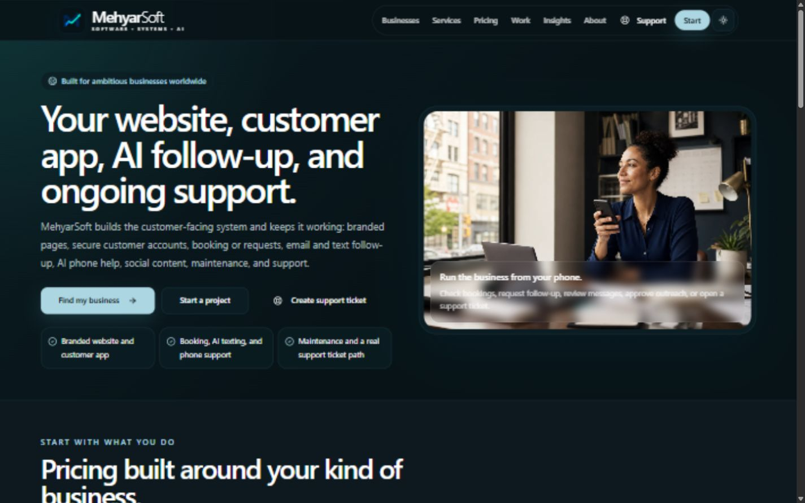

The first screen is visually coherent, but it promises only customer-facing systems and presents three competing actions, including support, before establishing proof or enterprise capability.

### Barber desktop offer

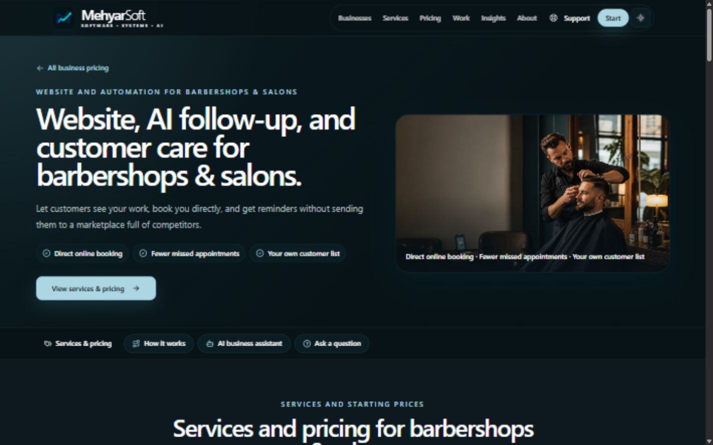

The barber hero is one of the strongest parts of the site: relevant image, direct outcome language, and visible pricing navigation.

### Barber pricing

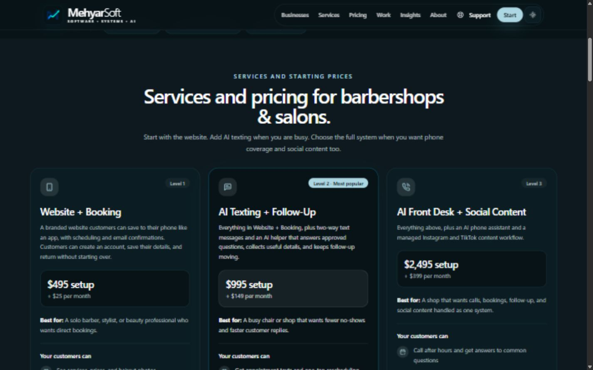

The three levels are understandable, but the page later expands into three more agent plans and ten workflows, weakening this simple comparison.

### Professional-services buyer

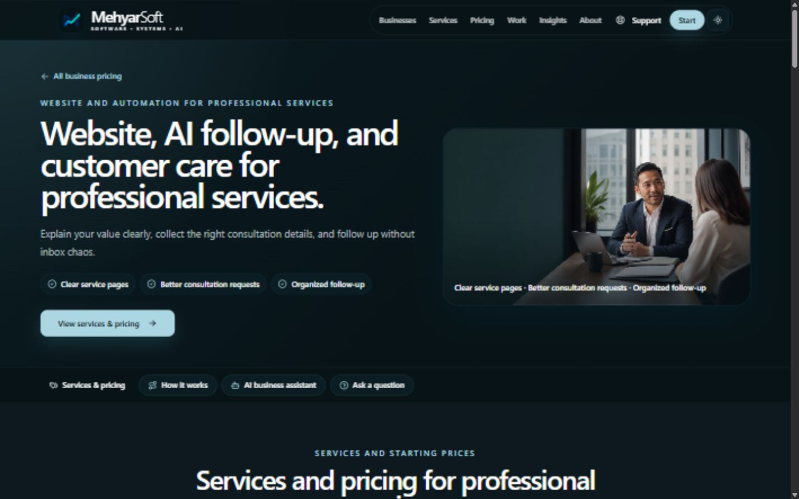

A lawyer searching the site lands on a broad “professional services” template. It does not demonstrate legal intake, conflict-check routing, confidentiality boundaries, matter workflows, document workflows, or law-firm proof.

### Mobile homepage

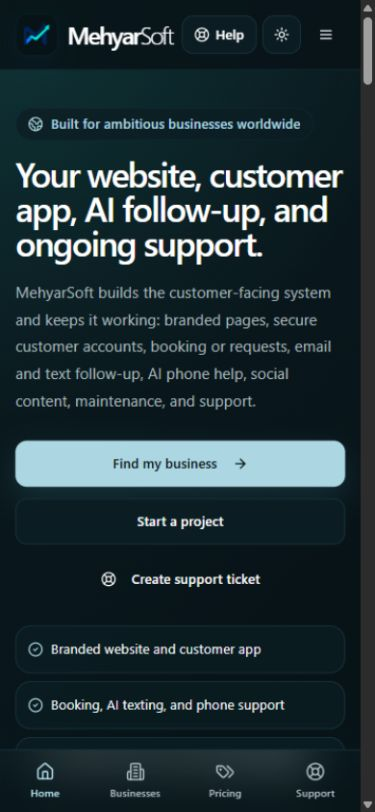

The mobile hero uses nearly the entire first viewport for copy and actions. The image, proof, industries, and capabilities are below the fold, while support appears three times through Help, the hero, and the bottom bar.

### Mobile menu

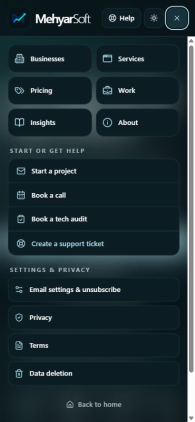

The full menu does reach most public pages, which is a strength. The persistent bottom navigation is the weaker layer: Businesses and Pricing are effectively the same route, while Services, Work, Booking, and Contact are absent.

### Mobile barber page

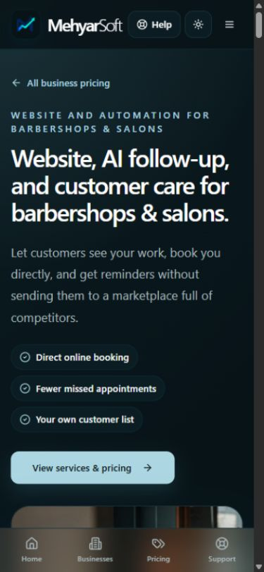

The local-business message works, but the hero image starts below the fold and the fixed bottom navigation consumes space throughout an approximately 18,000 px page.

### Mobile barber pricing

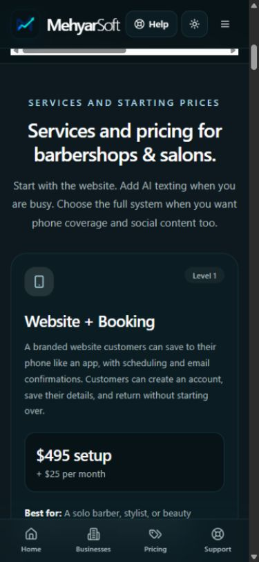

The section pill navigation is horizontally scrollable. Its browser-like scrollbar and off-screen options make it look broken rather than intentionally swipeable.

### Lawyer search on mobile

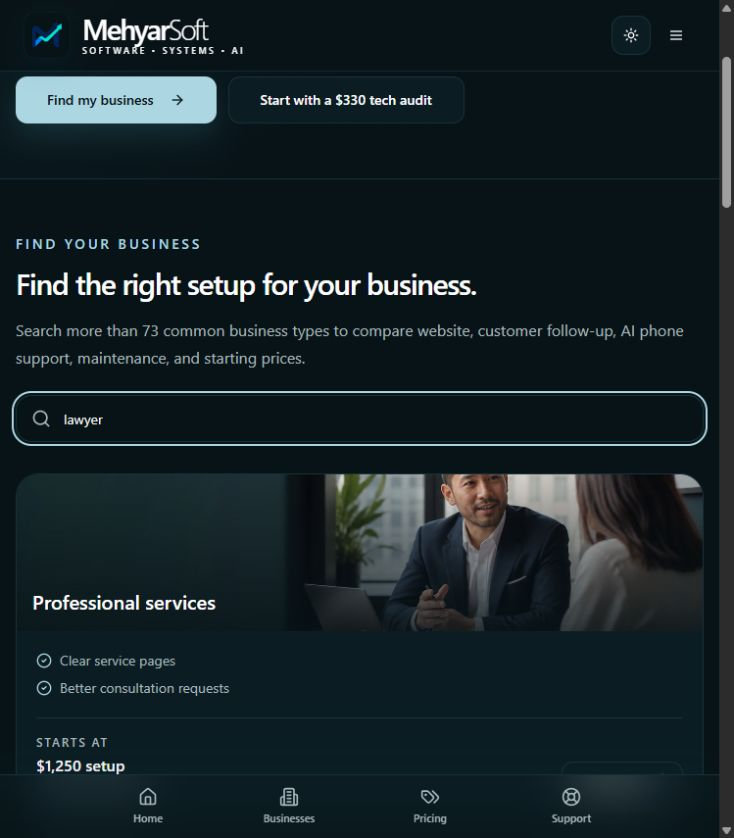

Search correctly finds “Professional services,” but the result is not lawyer-specific. The separate directory of 73 aliases remains below even when search is active.

### Mobile support modal

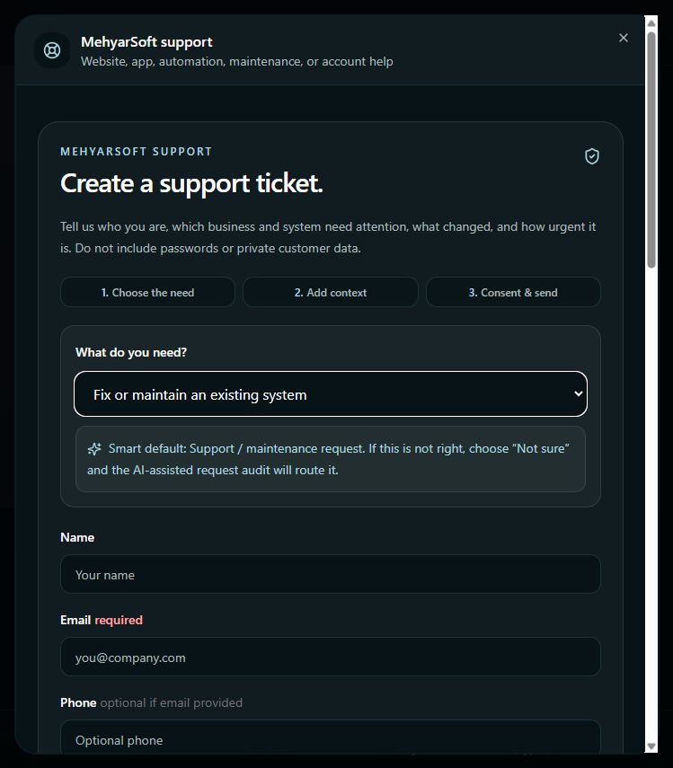

The support flow is visually polished but much too long for an urgent customer. It reuses a general intake architecture and asks for relationship, system, help type, urgency, contact method, budget, website, consent, and more.

### Empty proposal directory

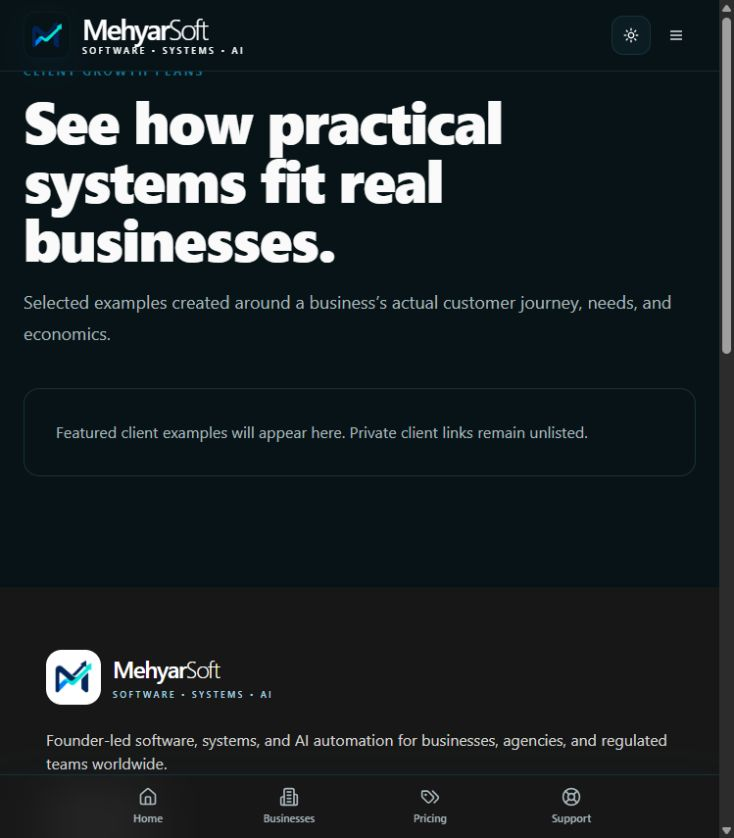

The footer promotes “Client growth plans,” but the destination contains no examples. This damages trust at the exact moment a visitor asks for proof.

### Mobile booking

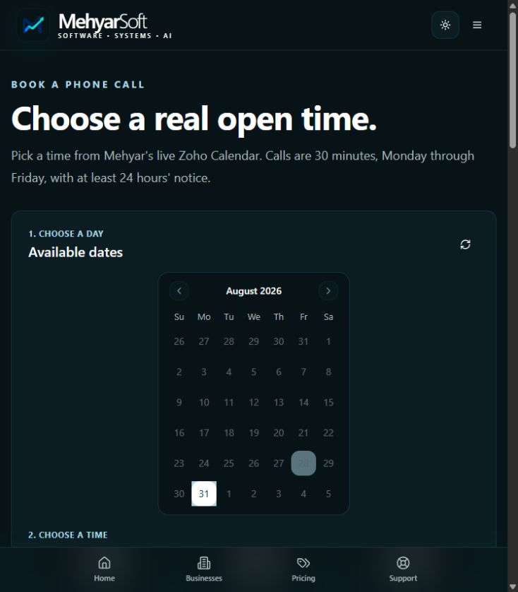

The calendar works and is readable. For a global company, however, displaying only ET/EDT without local-time conversion or a timezone selector creates avoidable booking uncertainty.

## Forty-five findings

### Positioning and homepage

1. **Critical — The homepage makes the company look like a customer-facing small-business agency.** The hero leads with “website, customer app, AI follow-up, and ongoing support.” It does not communicate CRM platforms, enterprise AI, backend/API systems, databases, cloud architecture, DevOps, or complex internal software.

2. **Critical — There is no clear audience split.** A barber and a pharma engineering leader enter the same homepage and receive the same primary story. Create explicit “For growing businesses” and “For enterprise teams” paths above the fold.

3. **Critical — Enterprise capabilities are missing from the public capability map.** AWS, Azure, Google Cloud, enterprise DevOps, data platforms, system modernization, observability, and large-scale backend delivery are not visibly sold.

4. **High — “Cloudflare-first” narrows credibility.** The Services page says “Cloudflare-first” even though MehyarSoft can work across AWS, Azure, Google Cloud, Cloudflare, and hybrid environments. An enterprise buyer may incorrectly assume platform limitation.

5. **Critical — There is no enterprise or regulated-industry landing page.** Pharma, fintech, media, SaaS, healthcare, and large-company buyers need a separate page covering security, identity, data controls, integration, auditability, deployment, governance, and delivery models.

6. **Critical — The homepage has no proof block.** There are no recognizable client logos, testimonials, shipped-system screenshots, outcome metrics, certifications, partner badges, or named case studies before the visitor is asked to start.

7. **High — The homepage looks and behaves like a second pricing page.** It repeats the business search, the same industry cards, and the same starting prices. The homepage should explain company breadth and route audiences; Pricing should compare packages.

8. **High — The hero presents three competing actions.** “Find my business,” “Start a project,” and “Create support ticket” split attention. New prospects need one primary action and one secondary path.

9. **High — Support is over-promoted to new prospects.** Support appears in the desktop navigation, mobile Help button, hero, maintenance section, footer, and bottom navigation. It makes the site feel like a customer portal before the visitor becomes a customer.

10. **High — Mobile uses the first viewport inefficiently.** The hero copy, three actions, and three feature chips fill the screen. The visual, trust proof, customer types, and capability breadth are not visible without scrolling.

11. **Medium — “Leak” is overused as the master metaphor.** “Send the leak,” “where the business is leaking,” “lead leak,” and “protect revenue” are memorable once but become negative and repetitive across the whole site. Enterprise buyers may find it informal.

12. **High — Repetition replaces a differentiated company story.** Website, booking, missed calls, follow-up, and support are repeated on Home, Services, Pricing, Contact, Portfolio, blog CTAs, and industry pages. The site needs a hierarchy, not more copies of the same promise.

### Navigation and mobile design

13. **Critical — Mobile “Businesses” and “Pricing” are effectively duplicates.** Businesses links to `/pricing#industry-pricing`; Pricing links to `/pricing`. Both land on the same page and nearly the same section.

14. **Critical — The mobile bottom bar omits more valuable destinations.** Services, Enterprise, Work, Booking, and Contact are missing. A better five-tab model is Home, Solutions, Industries, Work, and Contact; Support belongs in Help/More for existing clients.

15. **Medium — The mobile header changes from page to page.** Home shows a Help button; Pricing and other pages often remove it and show a larger logo lockup. The shifting controls weaken the app-like promise.

16. **High — Industry section navigation has weak horizontal-scroll affordance.** Two pills sit off-screen, and the visible scrollbar looks like a layout defect. Use a compact segmented menu, a “More” sheet, or a sticky section selector.

17. **Medium — The fixed bottom navigation obscures content.** It covers the lower part of cards and reduces usable screen height on already long pages. Add more bottom safe-area padding and avoid placing important text/actions beneath it.

18. **Critical — Mobile pages are far too long.** The ten industry pages are roughly 17,700–18,000 px tall; the proposal is about 11,000 px; Pricing exceeds 10,000 px. A buyer should not need a multi-minute scroll to understand the offer.

19. **Critical — Services is approximately 19,750 px tall on mobile.** It contains FAQ answers, service catalog, full industry directory, 73 aliases, agent offers, maintenance plans, delivery approach, and another CTA. Split it into Solutions, Enterprise Engineering, Managed AI, and Support pages.

### Industries and pricing

20. **High — The ten industry pages use almost the same architecture and length.** Each has 28 headings, 44 links, three levels, the same agent comparison, ten uses, three agent plans, and the same safety note. Specific nouns change, but the experience still feels generated from one template.

21. **High — “73 business types” overstates specialization.** The 73 names are aliases mapped to only ten industry pages. “Lawyer,” “CPA,” “architect,” and “marketing agency” all receive Professional Services, despite very different workflows and risks.

22. **High — Search filters only the main cards, not the full alias directory.** Searching “lawyer” shows the Professional Services card, but all 73 alias links remain below. The result is still a long directory instead of a focused answer.

23. **Critical — A lawyer does not receive a lawyer-specific sales page.** Missing topics include consultation and matter intake, conflict-check routing, confidentiality, document collection, deadline workflows, call qualification, legal-advertising controls, and human review.

24. **High — Regulated and sensitive verticals need stronger boundaries.** Clinics, therapists, veterinarians, legal firms, finance, and insurance should not inherit mostly the same AI texting/voice/social pitch. Each needs clear data-minimization and human-decision boundaries.

25. **High — Level 3 forces unrelated services into one bundle.** AI phone support and Instagram/TikTok content are paired for every industry. A law firm may want intake and phone routing but no reels; a creator may want social without voice automation.

26. **High — Core levels do not consistently show all purchase models.** The main Level 1–3 cards emphasize setup plus monthly pricing, while annual and customer-owned infrastructure options appear later only for agent products. Show monthly, annual, and fixed/owned options consistently where they actually apply.

27. **High — Pass-through costs are too open-ended.** Texts, call minutes, AI generation, third-party subscriptions, ad spend, and integrations are “confirmed in writing.” Buyers need included allowances and example overage ranges to estimate the real bill.

28. **High — OpenClaw and Hermes are introduced brand-first.** Most buyers do not know or care which agent framework is used. Lead with “24/7 AI Command Center” or “Your private AI business assistant,” then disclose the underlying platform in technical details.

29. **High — “Operator” is colder than the promised experience.** “AI operator” can sound like surveillance or industrial automation. “AI Command Center,” “24/7 business assistant,” or “digital operations assistant” is easier to understand.

30. **High — Ten agent use cases plus three agent plans overwhelm the core purchase.** Show the four most valuable uses first, let the user expand the remaining six, and recommend one configuration based on the selected business.

### Proposals, portfolio, and persuasion

31. **Critical — The generated proposal’s observations are generic.** “Interested visitors may not see one obvious next step” and “manual processes risk missed appointments” do not prove that the target business was deeply studied.

32. **High — The proposal hero is visually impressive but poorly matched.** The current example uses a generic businessman and a very tall image. For a barber proposal, show the actual shop, service, booking flow, social work, or a believable branded mockup.

33. **Critical — The public proposal directory is empty.** The footer actively links to it, but visitors see “Featured client examples will appear here.” Either feature strong demos immediately or remove the public navigation link until ready.

34. **Critical — Portfolio items explicitly are not case studies.** “Engagement patterns” demonstrate thought process but cannot replace evidence. Add real work, anonymized results where necessary, before/after screenshots, deliverables, duration, and outcomes.

35. **Critical — There is no social proof.** No testimonial, review, client logo, revenue impact, time saved, conversion improvement, uptime record, or named partner is visible in the main journey.

### Forms and conversion flows

36. **High — Contact asks visitors to choose among too many similar paths.** Industry package, $330 audit, call, and general request compete before the form. Use one guided chooser: “I need growth,” “I need software/AI,” “I need enterprise engineering,” or “I need support.”

37. **High — The support modal is too long for support.** Existing customers need name/email, affected system, severity, and problem first. Relationship, help type, budget, website, marketing consent, and qualification can be filled from account context or asked later.

38. **High — Global booking is shown only in ET/EDT.** The site says worldwide, but the calendar does not show the visitor’s timezone, offer conversion, or explain whether the displayed time is local.

39. **Medium — Technical implementation language leaks into customer forms.** “Cloudflare verification loads…” and “AI-assisted request audit will route it” explain architecture rather than reassure the customer. Say “A security check will appear when the form is ready.”

### SEO, accessibility, and performance risks

40. **Critical — The XML sitemap is incomplete.** It lists 31 URLs and omits all ten industry pages, `/proposals`, and other important public paths. The most commercially valuable specialized pages are therefore harder for search engines to discover.

41. **High — Two valid pages get a runtime “Page Not Found” title.** `/apps` and `/data-deletion` render correct content, but the client-side SEO manager changes the browser title to “Page Not Found | MehyarSoft LLC.”

42. **Medium — Heading hierarchy skips levels.** Home, Services, Portfolio, newsletter, booking, proposals, legal pages, and portfolio details include jumps such as H1→H3 or H2→H4. This weakens document structure for assistive technology and search parsing.

43. **High — The production JavaScript bundle is about 997 KB before compression.** Brotli is enabled, but one monolithic bundle loads public marketing, forms, dashboards, proposal components, and other routes together. Route-level code splitting should reduce startup cost.

44. **Medium — Hashed assets use only a four-hour cache.** The JS/CSS filenames are content-hashed but ship `max-age=14400, must-revalidate`. They should generally use a long immutable cache policy. The full Chrome performance tracer was not configured, so real LCP/INP/CLS remains to be measured separately.

45. **Known deferred item — Instagram is absent.** The footer and navigation contain no Instagram link or icon for the `Mehyar.us` handle. Add it after the structural work, as requested, so it supports a coherent social-proof section rather than becoming another isolated footer icon.

## Persona conclusions

### Barber or salon owner

The hero, photo, direct-booking message, and three main levels are understandable. The page loses focus after pricing by introducing OpenClaw, Hermes, ten workflows, three additional agent packages, infrastructure ownership, and technical safety language. Keep the top half; compress the rest into “Your 24/7 AI Command Center” with four examples and one recommended plan.

### Lawyer or law firm

The site recognizes “lawyer” in search but routes to a generic Professional Services page. The buyer receives no law-firm proof and no explanation of conflict checks, confidentiality, matter intake, document handling, or review boundaries. This feels templated, not specialized.

### Clinic or regulated practice

The site shows some caution around AI advice, which is good. It still needs explicit safe-vs-unsafe examples, minimum-data intake, PHI boundaries, vendor review, staff escalation, retention, and clear statements that AI does not make clinical decisions.

### Restaurant, retail, real estate, and home services

The industry language is more relevant than the generic Services page, but all roads lead to the same three levels and agent catalog. These buyers need a visual demonstration of their actual workflow—reservation/private event, product/pickup, listing/lead, or quote/dispatch—not another feature inventory.

### Enterprise, pharma, fintech, media, or big-tech buyer

The current homepage does not look built for them. The Services page contains architecture and integration language but hides platform breadth, delivery maturity, cloud capability, security model, team augmentation, migration work, and operational ownership. A separate enterprise narrative is required.

## Recommended information architecture

### Desktop navigation

- Solutions
  - Customer platforms and CRM
  - AI systems and agents
  - Backend, APIs, and integrations
  - Data and databases
  - Cloud and DevOps
  - Websites, mobile apps, and PWAs
- Industries
  - Local and growing businesses
  - Healthcare and pharma
  - Legal and professional services
  - Fintech and financial services
  - Media and technology
- Enterprise
- Work
- Insights
- About
- Primary CTA: Book a consultation
- Secondary existing-client link: Support

### Mobile navigation

Use five distinct bottom destinations:

1. Home
2. Solutions
3. Industries
4. Work
5. Contact

Move Support, Pricing, Booking, Insights, About, legal pages, email settings, and data deletion into a well-organized More/menu sheet. Pricing should live inside Solutions and Industries rather than competing with Businesses as a duplicate tab.

## Recommended homepage structure

1. **Hero:** “Software and AI systems that move the business forward—from customer apps to enterprise platforms.”
2. **Two audience paths:** Growing Business Systems and Enterprise Engineering.
3. **Capability grid:** CRM, AI systems, backend/API, databases/data, cloud/DevOps, web/mobile/PWA, integrations, automation, security and operations.
4. **Industry pathways:** local business, legal, healthcare/pharma, fintech, media/technology, SaaS, and custom enterprise.
5. **Proof:** real systems, screenshots, metrics, testimonials, client logos, or anonymized case studies.
6. **How engagement works:** audit/discovery, architecture, build, launch, managed support.
7. **AI Command Center:** plain-language examples, not framework names.
8. **Focused CTA:** Book a consultation or describe the system you need.

## Recommended industry-page structure

1. Outcome-led hero with one primary CTA.
2. A four-step customer or staff journey with a visual demo.
3. Three simple service levels with monthly, annual, and owned/fixed options where applicable.
4. “Your 24/7 AI Command Center” with four visible high-value use cases and six expandable examples.
5. Optional add-ons: voice, social, CRM, analytics, custom integrations.
6. Proof relevant to that industry.
7. Maintenance, support, limits, and usage allowances.
8. One short recommendation form prefilled with the industry and selected level.

## Functional checks completed

1. Route crawl — **Healthy:** 66/66 generated routes returned HTTP 200.
2. Public rendered-page pass — **Healthy with content concerns:** 46 public routes loaded in the browser with no broken images or console errors.
3. Desktop home and navigation — **Functional, strategically narrow.**
4. Barber and professional-services journeys — **Functional, overly long and templated.**
5. Pricing search — **Functional but incomplete:** “lawyer” finds Professional Services, while the 73-item directory remains unfiltered.
6. Zoho booking — **Functional:** availability loaded, a date was selected, and time selection updated the form. No appointment was submitted during this audit.
7. Contact and support empty-state validation — **Functional:** required controls remain disabled and are labeled; the support modal is excessively long.
8. Mobile 390×844 pass — **Functional with IA issues:** no body-level horizontal overflow, but industry section pills intentionally overflow their rail and the fixed bottom bar reduces usable space.
9. SEO shell check — **Mixed:** route shells return correct titles, but client runtime changes `/apps` and `/data-deletion` to Page Not Found.
10. Performance evidence — **Partial:** Brotli and caching are active; the configured Chrome performance trace tool was unavailable, so real Core Web Vitals were not claimed.

## Evidence limits

- No live lead, support ticket, newsletter signup, or appointment was submitted during this audit, avoiding duplicate production records and emails.
- Empty-state validation, selection behavior, live availability, routes, DOM structure, visual rendering, and console health were tested.
- Admin pages returned their shells but authenticated admin functionality was outside this client-facing audit.
- Screenshot review can identify accessibility risks but cannot establish full WCAG compliance. Keyboard order, screen-reader behavior, contrast measurements, zoom reflow, and real-device testing remain separate tasks.
- The Chrome DevTools performance tracer was not configured. Bundle size and cache behavior were verified, but LCP, INP, CLS, TBT, and throttled-network results remain unmeasured.

## Recommended execution order

1. Fix positioning and navigation: separate Business Growth Systems from Enterprise Engineering.
2. Redesign mobile bottom navigation with five distinct destinations.
3. Rebuild Home around audience paths, capability breadth, and proof.
4. Shorten industry pages and rename the agent offer to AI Command Center.
5. Publish real demos/case studies and remove the empty proposal-directory state.
6. Simplify Contact and Support flows.
7. Fix sitemap, runtime titles, heading order, code splitting, and immutable asset caching.
8. Add the `Mehyar.us` Instagram icon/link and a coherent social-proof section.
